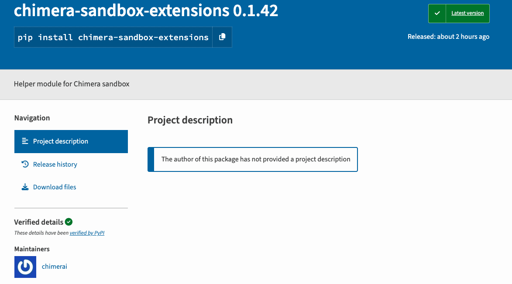

🧪 **Chimera-Sandbox-Extensions** : Un package PyPI malveillant vole des données sensibles sur AWS, CI/CD et macOS

---

## 📌 Faits essentiels

- **Nom du package** : [chimera-sandbox-extensions](https://jfrog.com/blog/chimera-sandbox-extensions-malware-threatens-pypi-users/)
- **Téléchargements** : 143 avant retrait
- **Objectif** : Vol de données cloud et de développement via une infection multi-étapes
- **Cible** : Développeurs utilisant Chimera Sandbox (outil open source publié par Grab)
- **Impact** : Fuite de tokens AWS, variables CI/CD, configs macOS Jamf, etc.
- **Plateformes touchées** : macOS, environnements DevOps, pipelines CI/CD

---

## 🧭 Déroulé de l'attaque

Le package malveillant se faisait passer pour un module complémentaire légitime de *Chimera Sandbox*, un framework de développement d’outils ML. Une fois installé :

1. **Connexion initiale via DGA**  
   Le module exécute un script générant dynamiquement un nom de domaine (DGA), puis s’y connecte pour récupérer un token d’authentification.

2. **Téléchargement du payload secondaire**  
   Le token authentifie une seconde requête HTTP vers le même domaine, retournant un *stealer* Python modulaire.

3. **Collecte des données**  
   Exfiltration de données sensibles :
   - JAMF receipts (macOS MDM)
   - Variables d’environnement CI/CD
   - Jetons AWS, config Zscaler
   - Infos Git locales, tokens d’accès
   - IP publique, infos système et utilisateur

4. **Exfiltration ciblée**  
   Les données sont envoyées via POST. Le serveur cible ensuite les machines jugées exploitables. Le *payload* final reste inconnu.

---

## 🧠 Analyse et portée

Selon JFrog, la campagne est sophistiquée :

- DGA pour contourner les défenses réseau
- Architecture à plusieurs étapes
- Ciblage professionnel DevOps

> “Le ciblage sélectif et la sophistication de cette chaîne d’infection sont une alerte forte sur l’évolution des menaces dans la chaîne logicielle open source.”  
> — *Jonathan Sar Shalom, JFrog*

---

## 🔍 Cas similaires sur npm : multi-stages, obfuscation et RATs

Autres packages malveillants repérés :

- `eslint-config-airbnb-compat` (676 téléchargements)
- `ts-runtime-compat-check` (1,588)
- `solders`, `@mediawave/lib`

Techniques observées :
- Scripts post-install dissimulés
- Obfuscation (Base64, Unicode japonais)
- DLL injectées dans des PNG (stéganographie)
- Contournement antivirus + élévation via `FodHelper.exe`
- Déploiement du RAT *Pulsar* (variante de *Quasar RAT*)

---

## ⚠️ Autres tendances associées

### 🪤 Slopsquatting & IA hallucinations

Les outils IA de dev (Claude CLI, Cursor, etc.) hallucinent des packages fictifs, que les attaquants préenregistrent pour les exploiter :

Exemple : `starlette-reverse-proxy` — halluciné par un LLM — aurait pu être piégé dans PyPI.

---

## 🛡️ Recommandations de sécurité

### Pour les développeurs

- Vérifier la réputation des dépendances (PyPI/npm, GitHub)
- Désactiver les scripts `post-install`
- Surveiller les connexions sortantes après une installation

### Pour les entreprises

- Filtrage DNS/DGA
- EDR pour comportements post-installation anormaux
- Politique de allowlist + détection transitive

---

## 📚 Sources techniques

- 🔗 [Le rapport de JFrog](https://jfrog.com/blog/chimera-sandbox-extensions-malware-threatens-pypi-users/)
- 🔗 [Analyse Unicode de Veracode](https://www.veracode.com/blog/down-the-rabbit-hole-of-unicode-obfuscation/)
