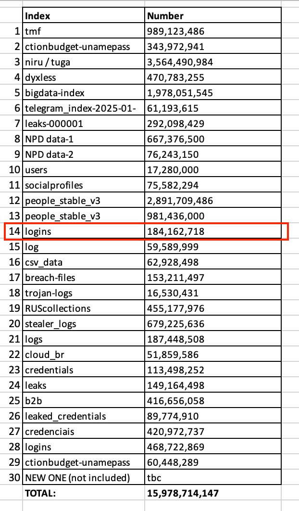

> Une fuite « historique » de 16 milliards d’identifiants secoue la toile. Mais faut-il vraiment paniquer ? Derrière les gros titres, les chiffres méritent d’être sérieusement remis en contexte.

---

## 🌍 Une ampleur annoncée comme historique

Selon **Cybernews**, une base de données baptisée *Mother of All Breaches* regrouperait **16 milliards de données d’identification** issues de 30 fuites distinctes.  
On y trouve : e-mails, mots de passe, tokens, cookies de session, etc.  
Une fuite alimentée essentiellement par des **malwares infostealers**, qui récupèrent les données directement depuis les machines infectées.

---

## ⚠️ Pourquoi cette fuite est-elle médiatisée comme si elle était critique ?

- **Données récentes et exploitables** : contrairement à des leaks obsolètes, certains identifiants sont encore actifs.
- **Services visés** : Google, Facebook, Apple, Telegram, GitHub, Zoom, voire des entités gouvernementales.
- **Menaces potentielles** :
  - Prise de contrôle de comptes personnels et pro
  - Usurpation d’identité
  - Rançongiciels
  - Phishing ciblé
  - Compromission de boîtes e-mails stratégiques (BEC)

---

## 🧠 Origine et format des données

- **Mode de collecte** : via des fichiers piratés, documents PDF infectés ou extensions malveillantes.
- **Structure des données** : souvent organisées comme `URL → identifiant → mot de passe`, accompagnées de cookies ou tokens pouvant contourner la 2FA.
- **Problème méthodologique** : le **nombre exact d'utilisateurs affectés reste incertain**. Certains experts parlent de plusieurs milliards de comptes, mais les doublons et répliques rendent le chiffre flou.

---

## 🔍 Des chiffres spectaculaires… mais peu crédibles

Voici pourquoi il faut **relativiser cette fuite** malgré son volume :

- ❌ **Beaucoup de doublons** : certaines données sont présentes **dans plusieurs fuites depuis des années**.
- ❌ **Réutilisation de leaks anciens** : Cybernews agrège des fuites déjà publiques pour gonfler le total.
- ❌ **Peu de preuves d’attaques directes contre les grandes plateformes** : les comptes sont siphonnés **via les machines des utilisateurs**, pas via les serveurs de Google, Apple ou Meta.
- ❌ **Tokens ≠ mots de passe** : les tokens Telegram, très cités, sont souvent inutilisables seuls sans session active ou 2FA.
- ❌ **Improbabilité technique** : 16 milliards d’identifiants « frais » supposerait une infection massive de centaines de millions d’ordinateurs, simultanément — **ce qui n’a pas été constaté sur le terrain**.

> Ce chiffre de 16 milliards sert davantage à faire la une qu’à refléter une réalité précise.

---

## 💬 Derrière la peur : du marketing ?

Ces "méga fuites" sont parfois montées en épingle pour :

- **Vendre des services premium de détection de fuite**
- **Générer du trafic via des alertes anxiogènes**
- **Faire le buzz médiatique** sans base factuelle solide

Beaucoup d’acteurs de la cybersécurité dénoncent un **manque de rigueur dans la communication de Cybernews** ou de bases similaires.

---

## 🛡️ Comment réagir intelligemment

Même si les chiffres sont gonflés, les risques restent réels. Voici les **bonnes pratiques à adopter** :

- ✅ Changez tous vos mots de passe (surtout si vous réutilisez les mêmes)
- ✅ Activez la **double authentification (2FA)** partout
- ✅ Utilisez un **gestionnaire de mots de passe**
- ✅ Vérifiez vos comptes sur des services comme [HaveIBeenPwned](https://haveibeenpwned.com) ou [Cybernews Password Checker](https://cybernews.com/personal-data-leak-check/)
- ✅ Restez vigilant aux signaux d’alerte : mails suspects, connexions inconnues, etc.
- ✅ N’installez jamais d’extensions ou de logiciels sans source fiable

---

## 📌 Conclusion

Cette fuite, bien que potentiellement sérieuse, **n’est pas une apocalypse numérique**.  
Elle marque surtout une **évolution du cybercrime** vers la **monétisation massive des données volées** via des compilations “prêtes à l’emploi”.

> 🔎 Soyez informé, pas manipulé : le vrai danger n’est pas toujours là où le chiffre est le plus gros.

---

## 🔗 Sources & analyses critiques

- [Cybernews – 16 billion credentials exposed](https://cybernews.com/security/billions-credentials-exposed-infostealers-data-leak/)
- [HaveIBeenPwned](https://haveibeenpwned.com)