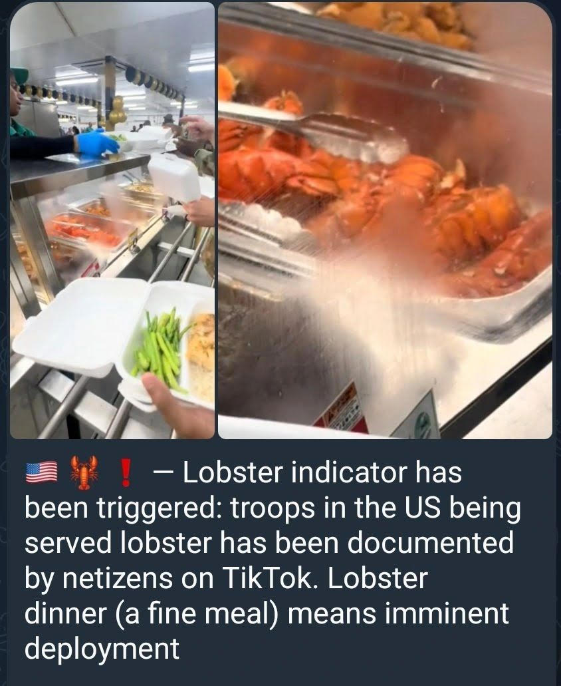

> **OSINT – Signal faible**  
> 🦞 *Le homard en guise d’indice stratégique ?*  
> 📡 **Les menus de cantine deviennent un outil d’analyse géopolitique**

---

## 🥩🦞 Qu’est-ce que l’indicateur du homard ?

Un surnom donné à un phénomène bien connu des analystes militaires :  
> **Avant certains déploiements sensibles**, les bases américaines servent des repas exceptionnellement luxueux (steak, homard, desserts spéciaux).

Objectif : **booster le moral** des troupes avant des opérations à haut risque.

Mais à l’ère des réseaux sociaux, ces festins ne passent plus inaperçus...

---

## 📱 Une source OSINT inattendue : TikTok & Instagram

Des soldats ou leurs proches partagent des **photos/vidéos de repas** sur les réseaux.

🛰️ Pour les analystes OSINT, cela devient un **signal faible croisé** :

- Présence simultanée de menus festifs sur plusieurs bases  
- Contexte géopolitique tendu  
- Données logistiques concordantes

---

## 🔍 Pourquoi cela compte aujourd’hui ?

Ces dernières semaines :

- 🚢 Renforcement de la présence navale US dans le Golfe Persique  
- ✈️ Multiplication des vols stratégiques & mouvements de troupes  
- ⚠️ Rumeurs de frappes liées au programme nucléaire iranien  
- 🍽️ Posts TikTok montrant des repas « festifs » sur plusieurs bases

📌 Résultat : une **corrélation inquiétante** entre signaux humains et mouvements militaires.

---

## 🎯 Leçon d’OSINT : attention aux signaux faibles

L’OSINT, ce n’est pas que satellites et documents classifiés :

- C’est aussi **comprendre les rituels, habitudes et comportements**
- Un **menu inhabituel** peut annoncer un événement géopolitique majeur
- Ne pas repérer ces signaux = rater une partie du puzzle stratégique

---

## 🛑 Conclusion : un avertissement silencieux ?

Le “steak & homard” pourrait redevenir ce qu’il fut souvent par le passé :  
> **Le dernier repas tranquille avant la tempête.**

📡 **OSINT = Données banales + contexte stratégique = insight puissant**

> "L’important n’est pas ce que l’on cache, mais ce que l’on ne regarde pas."

---

## 🔗 Sources de l'OSINT :

- [Vidéo Tiktok : ARMY STEAK AND LOBSTER](https://www.tiktok.com/@melly.fits/video/7466644576044961070)