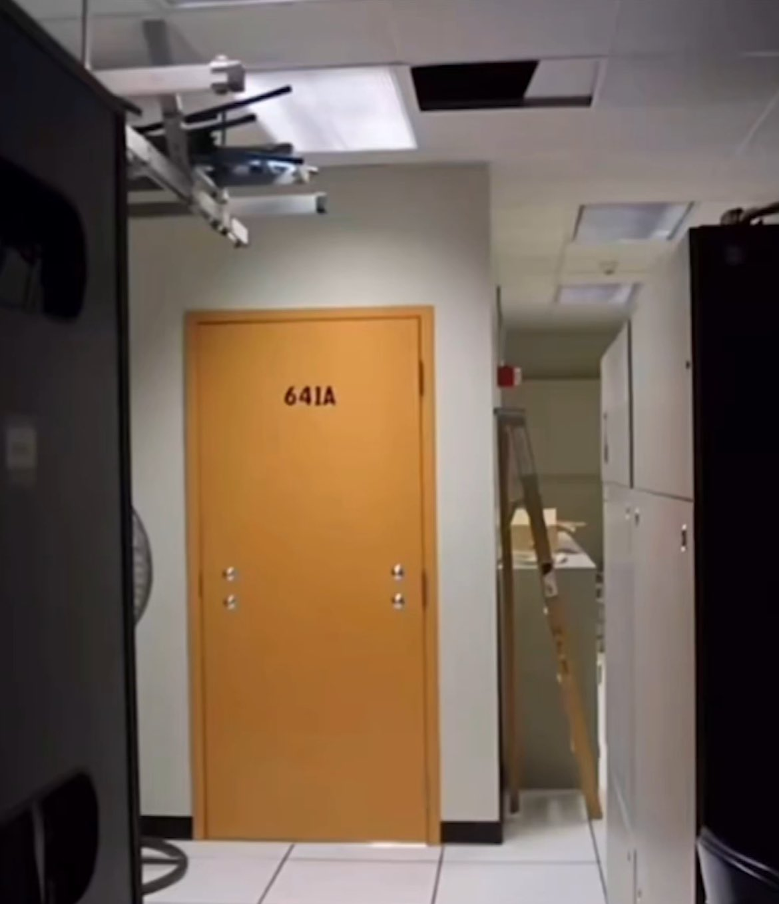

> **Room 641A**, révélée en 2006, est une **salle secrète** implantée au siège d’AT&T à San Francisco.  
> Son rôle : **dupliquer tout le trafic Internet** via fibre optique pour l’envoyer à la NSA, dans le cadre d’un programme de surveillance de masse.

---

## 🏢 Un immeuble banal… ou presque

📍 **611 Folsom Street, San Francisco** : un bâtiment administratif sans histoire, siège d’**AT&T**, le plus grand opérateur télécom américain.

Mais au **6ᵉ étage**, une pièce intrigue : **Room 641A**, totalement **absente des plans**, sans accès pour les techniciens standard.

---

## 💣 La révélation explosive de Mark Klein

En **2006**, Mark Klein, ancien technicien AT&T, décide de **briser le silence** :

> “J’ai découvert une salle dédiée à la **duplication intégrale du trafic Internet**, connectée à un système de surveillance de la NSA.”

🛠️ Il s’agit d’une infrastructure installée secrètement pour :

- **Copier** le trafic Internet entrant et sortant via un **splitter optique**
- Rediriger une copie vers un **système d’analyse** automatisé (probablement **Narus Insight**)
- Le tout, **sans mandat judiciaire** spécifique – dans le cadre du programme **PRISM**

---

## 🔍 Ce que permettait Room 641A

| Fonction                      | Description                                                                 |
|------------------------------|-----------------------------------------------------------------------------|
| Interception                  | Splitter optique installé sur le backbone AT&T                             |
| Analyse                       | Traitement en temps réel via un dispositif automatisé                      |
| Destinataire final            | National Security Agency (NSA)                                             |
| Mandat ?                      | Aucun – collecte de masse sans autorisation nominative                     |

---

## 🎯 Pourquoi c’est encore important aujourd’hui

- 📡 **Première preuve concrète** de collaboration entre un opérateur privé et la NSA
- 🔓 Une **fuite historique** qui a précédé Snowden de plusieurs années
- 🔍 Désormais, **certains datacenters** sont surveillés **officiellement**
- 🧠 Ce cas a marqué le début de la **prise de conscience du public** sur la surveillance numérique globale

---

## 🎥 À voir pour mieux comprendre

📎 Je vous recommande la vidéo de [Sylqin](https://www.youtube.com/@Sylvqin) qui m'a fait découvert cette histoire incroyable :

[🔗 La salle 641A, le centre d'espionnage de la NSA ?](https://www.youtube.com/watch?v=RXF5sJch378&t=330s)

---

## 🧠 En résumé

💡 L’affaire **Room 641A** a montré que la **surveillance de masse à l’échelle mondiale** n’était pas une fiction paranoïaque, mais **une réalité technique et politique**.

🔐 Ce genre de dispositif continue d’exister, **souvent intégré** aux architectures réseau des grands opérateurs.

🧭 Cette affaire rappelle l’importance de la **transparence, du chiffrement** et de la **vigilance collective** dans un monde hyper-connecté.
