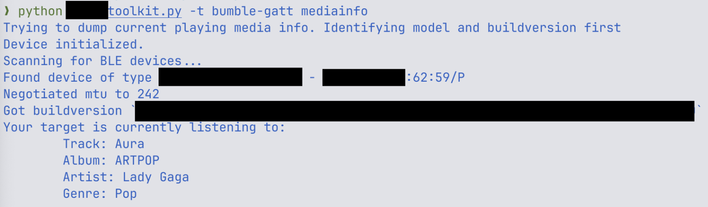

> Des failles critiques dans les puces Bluetooth d’Airoha exposent vos écouteurs à des attaques à distance. Et contrairement à certaines affirmations exagérées, cette menace est sérieuse mais ciblée. Voici les faits.

---

## 🚨 Une faille massive mais silencieuse

Des chercheurs en cybersécurité ont dévoilé lors de la conférence **TROOPERS** une série de **vulnérabilités critiques** dans les puces Bluetooth **Airoha**, très répandues dans les écouteurs, casques et enceintes.  
Aucune interaction de l’utilisateur n’est nécessaire : un pirate **dans un rayon de 10 mètres** peut **prendre le contrôle complet de l’appareil**.

---

## 🛠️ Détails techniques des failles (CVE-2025-20700 à 20702)

Les failles concernent un **protocole propriétaire puissant exposé sans authentification**, accessible via Bluetooth classique (BR/EDR) et BLE :

- 📡 Lecture/écriture de la mémoire RAM et flash
- 🎧 Possibilité d’écouter l’environnement via le micro
- 📱 Usurpation d’identité vis-à-vis d’un téléphone appairé
- ☎️ Déclenchement d’appels via HFP (Hands-Free Profile)
- 🪱 Propagation de malware d’un appareil à l’autre (wormable)

---

## 📋 Appareils concernés (extraits confirmés)

Parmi les marques et modèles touchés :

- **Sony** : WH-1000XM4/5/6, WF-1000XM3/4/5, CH-720N, Link Buds S, etc.
- **Marshall** : MAJOR V, MINOR IV, MOTIF II, WOBURN III, ACTON III…
- **Bose** : QuietComfort Earbuds
- **JBL** : Endurance Race 2, Live Buds 3
- **Jabra** : Elite 8 Active
- **Beyerdynamic**, **Teufel**, **JLab**, **MoerLabs**, etc.

La plupart des modèles d’entrée de gamme **comme premium** sont vulnérables.

---

## 👂 Ce qu’un attaquant peut vraiment faire

Les attaques sont **réalistes, mais complexes** et ciblées :

- Il faut être **dans la même pièce que la victime**
- Les manipulations requièrent un **haut niveau technique**
- L’attaque **interrompt l’audio** en cours, ce qui la rend visible

Mais pour des **profils à haut risque** (journalistes, activistes, diplomates), ces failles représentent une **menace sérieuse** :

> Un attaquant pourrait extraire les clés de chiffrement du casque, usurper son identité auprès du téléphone, passer un appel, et écouter ce qui se passe autour du mobile.

---

## 🧩 Un cauchemar pour la chaîne d’approvisionnement

Ces failles montrent une fois de plus la **fragilité des chaînes hardware** :

- Des **centaines de produits** partagent le même SoC sans le savoir
- Certains fabricants **ignorent utiliser Airoha**, ayant sous-traité les modules Bluetooth
- Les correctifs **ne sont pas systématiques**, surtout sur les appareils anciens ou bas de gamme

---

## 🛡️ Dois-je m’inquiéter ?

- 🔒 Si vous êtes **un particulier**, le risque reste **faible** en pratique.
- 🎯 Si vous êtes une **cible sensible**, évitez tout usage de casques Bluetooth non mis à jour.
- ⏳ Un correctif est en cours de déploiement par Airoha (à partir du 4 juin 2025), mais **aucun firmware corrigé n’est encore disponible** publiquement.

> Pour réduire les risques : désappairez vos écouteurs jusqu’à mise à jour, ou utilisez un casque filaire.

---

## 📅 Chronologie de la divulgation

- **25 mars 2025** : signalement des failles à Airoha
- **27 mai 2025** : première réponse d’Airoha
- **4 juin 2025** : SDK corrigé envoyé aux fabricants
- **26 juin 2025** : divulgation publique partielle

---

## 🔗 Source principale

- [🔗 Insinuator – Article de recherche original](https://insinuator.net/2025/06/airoha-bluetooth-security-vulnerabilities/)
