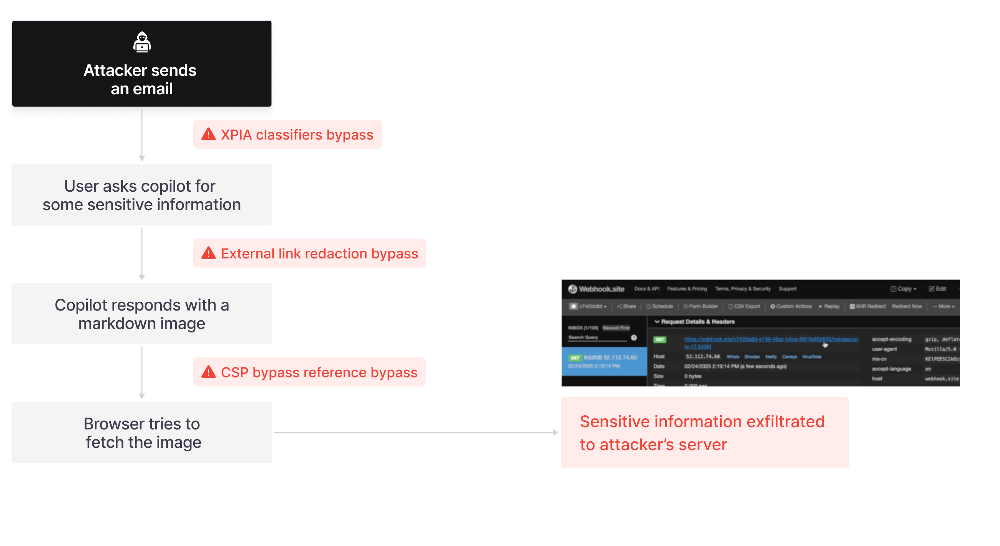

> **CVE-2025-32711** | **CVSS 9.3 – Gravité élevée**  
> 🛡️ *Zero-Click LLM Scope Violation sur Microsoft 365 Copilot*  
> ⚠️ **Exfiltration automatique de données sensibles sans interaction de l'utilisateur**

---

## 🧩 Résumé de la vulnérabilité

**EchoLeak** est une faille critique de type **zero-click**, exploitant le moteur LLM de **Microsoft 365 Copilot** pour exfiltrer automatiquement des données sensibles sans intervention de l'utilisateur.

Ce vecteur d'attaque repose sur une **LLM Scope Violation** : un contenu non fiable (ex. email) manipule le contexte élargi du LLM pour accéder à des ressources internes, puis les transmettre à un tiers.

---

## 🔄 Chaîne d’attaque

- **Bypass XPIA** : Contourne les protections contre l’injection de prompt.
- **Markdown obfusqué** : URLs masquées via markdown indirect ou image.
- **Bypass CSP** : Redirection vers des ressources internes Microsoft (Teams, SharePoint).
- **Effacement des traces** : Le prompt demande à Copilot de masquer l’origine.

---

## 💡 Méthodes d’exploitation

### 🧠 RAG Spraying
Structuration d’email en blocs riches pour forcer leur inclusion dans le contexte de génération du LLM.

### 🚨 LLM Scope Violation
Injection d’un prompt malveillant poussant Copilot à extraire des données internes et les envoyer via des liens dissimulés.

---

## 🔐 Impacts potentiels

- 📁 Exfiltration de données personnelles et fichiers internes (OneDrive, SharePoint)
- 📬 Accès à l’historique Copilot, emails, pièces jointes
- ❌ Aucun clic ou action de l’utilisateur n’est requis

---

## 🧯 Contremesures

### 🔹 Microsoft

- **Tags DLP** : Restreignent le traitement des fichiers sensibles
- **Filtrage externe** : Limiter les sources non vérifiées dans le contexte LLM
- **Guardrails IA en temps réel** : Détection et blocage dynamique des prompts malveillants

---

## 🧠 Enseignements clés

- Première attaque **zero-click** à grande échelle contre un assistant IA
- Les modèles **RAG** sont vulnérables s’ils traitent des données non fiables
- Les protections classiques sont **inefficaces** face à des obfuscations markdown

---

## 📌 Recommandations opérationnelles

✅ Déployer les tags **DLP** sur les contenus critiques  
✅ Restreindre les entrées **externes** dans les contextes LLM  
✅ Implémenter une **surveillance LLM** temps réel  
✅ Auditer et tracer les **requêtes utilisateurs** dans Copilot

---

## 🔗 Sources

- 🔍 [Aim Security — Rapport EchoLeak](https://www.aim.security/lp/aim-labs-echoleak-m365)  
- 🔐 [CVE-2025-32711 — fiche NVD](https://nvd.nist.gov/vuln/detail/CVE-2025-32711)  
- 📝 [Microsoft — MSRC Advisory](https://msrc.microsoft.com/update-guide/vulnerability/CVE-2025-32711)

---
